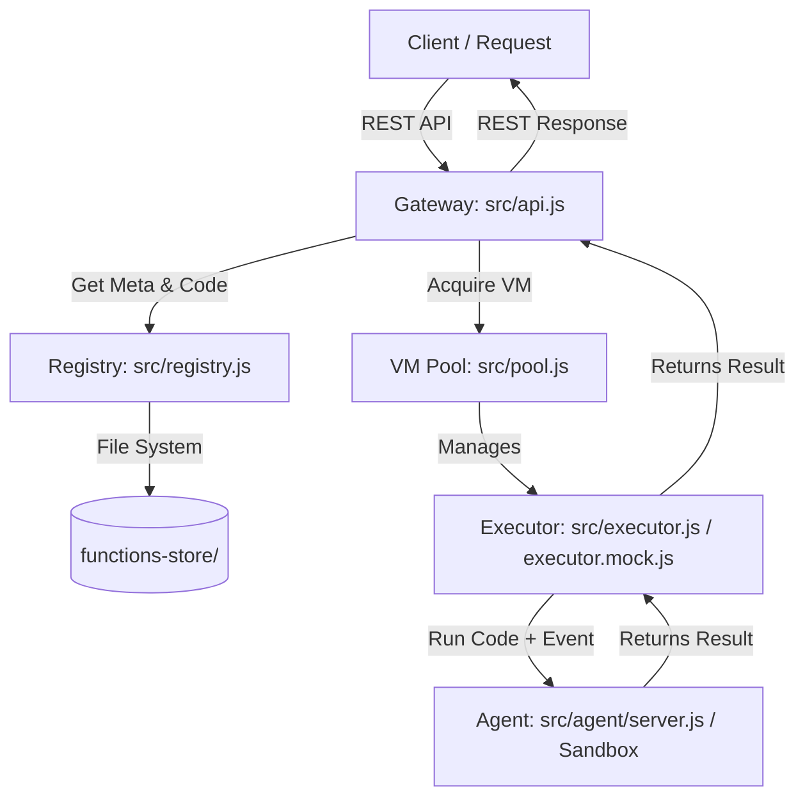

# MicroLambda 🚀

MicroLambda is a lightweight, high-performance serverless function execution platform. Mimicking the design of AWS Lambda, it provides secure, isolated execution environments for JavaScript functions. It natively leverages **Firecracker microVMs** for production-grade sandboxing, while offering a built-in **VM Sandboxed Fallback** (using Node.js `vm`) for seamless development on macOS and local machines without KVM support.

Featuring a pre-warmed VM pool to minimize cold starts, dynamic code loading, and a RESTful gateway API, MicroLambda makes deploying and executing serverless functions extremely fast and simple.

---

## 📐 Architecture & Flow

MicroLambda consists of five main components working in harmony:



1. **Gateway (`src/api.js`):** An Express REST API that handles HTTP requests to deploy, list, delete, and invoke functions.
2. **Registry (`src/registry.js`):** Manages metadata and file storage for deployed functions inside the `functions-store/` directory.
3. **VM Pool (`src/pool.js`):** Dynamically allocates and recycles VM executors. Pre-warms a set number of VMs on startup, replenishes the pool asynchronously when a VM is acquired, and recycles healthy VMs to prevent cold start latency.
4. **Executor (`src/executor.js` or `src/executor.mock.js`):** 
   - **Production (Firecracker):** Bootstraps Firecracker microVMs, manages TAP network configurations, and communicates with the in-VM agent over HTTP.
   - **Local Dev (Mock Sandbox):** Fallback executor that isolates function execution inside Node's native `vm` module to simulate VM sandboxing locally.
5. **Agent (`src/agent/server.js`):** A lightweight Node.js HTTP server running *inside* the Firecracker guest microVM, responsible for executing incoming code dynamically in a secure context.

---

## ⚡ Execution Modes

| Mode | Target OS | Sandboxing Layer | Description |
|:---|:---|:---|:---|
| **Production** | Linux (with KVM) | Firecracker microVM | True hardware-level virtualization. Bootstraps actual microVMs in milliseconds and configures network TAP devices. |
| **Development** | macOS / Windows / Linux | Node.js `vm` Module | Local simulation fallback. Runs code in isolated JavaScript contexts without requiring KVM or virtualization packages. |

---

## ⚙️ Configuration (`config.js`)

The platform's global settings can be adjusted in the `config.js` file:

```javascript
module.exports = {
  FIRECRACKER_BIN: "/usr/local/bin/firecracker", // Path to Firecracker executable
  KERNEL_PATH: "/opt/microlambda/kernel/vmlinux.bin", // Path to uncompressed kernel image
  ROOTFS_PATH: "/opt/microlambda/rootfs/base.ext4",   // Path to base ext4 filesystem
  SOCKET_BASE: "/tmp/fc-sockets",                    // Directory for VM Unix sockets
  TAP_BASE: "tap",                                   // TAP device name prefix
  VM_SUBNET: "172.16",                               // Base subnet for VM networking
  POOL_SIZE: 5,                                      // Target pre-warmed VM pool size
  AGENT_PORT: 7000,                                  // HTTP port inside the guest VM
  FUNCTION_TIMEOUT_MS: 30000                         // Default execution limit
};
```

> [!NOTE]
> On macOS/local environments, the active pool size defaults to `3` (defined in `src/pool.js`) and relies on `executor.mock.js` for execution.

---

## 📂 Project Directory Structure

```text
microlambda/
├── src/
│   ├── api.js           # Express API gateway
│   ├── registry.js      # Handles storage & retrieval of functions
│   ├── pool.js          # Pre-warmed VM manager (acquires, replenishes, recycles)
│   ├── executor.js      # Firecracker VM lifecycle manager (real microVMs)
│   ├── executor.mock.js # Mock VM executor using Node's sandbox module
│   └── agent/
│       └── server.js    # Code runner agent (baked into the rootfs image)
├── functions-store/     # Local storage folder for deployed user functions
├── kernel/
│   └── vmlinux.bin      # Linux kernel binary (for real Firecracker execution)
├── rootfs/
│   └── base.ext4        # Base root file system (for real Firecracker execution)
├── config.js            # Main configuration file
└── package.json         # Dependencies and start scripts
```

---

## 🔌 API Reference

### 1. Deploy a Function
Uploads function code and configuration metadata to the registry.

* **URL:** `/functions`
* **Method:** `POST`
* **Headers:** `Content-Type: application/json`
* **Request Body:**
  ```json
  {
    "name": "hello-world",
    "code": "exports.handler = async (event) => { return { message: 'Hello ' + event.name }; };",
    "handler": "handler",
    "timeout": 5000,
    "memory": 128
  }
  ```
* **Response Body (201 Created):**
  ```json
  {
    "ok": true,
    "name": "hello-world",
    "handler": "handler",
    "timeout": 5000,
    "memory": 128,
    "createdAt": 1774670835657
  }
  ```

---

### 2. Invoke a Function
Executes a registered function with the provided event payload.

* **URL:** `/invoke/:name`
* **Method:** `POST`
* **Headers:** `Content-Type: application/json`
* **Request Body:**
  ```json
  {
    "name": "Alice"
  }
  ```
* **Response Body (200 OK):**
  ```json
  {
    "success": true,
    "result": {
      "message": "Hello Alice"
    },
    "executionMs": 1,
    "vmId": 1,
    "function": "hello-world",
    "coldStart": false,
    "totalMs": 2
  }
  ```

---

### 3. List Functions
Retrieves metadata for all deployed functions.

* **URL:** `/functions`
* **Method:** `GET`
* **Response Body (200 OK):**
  ```json
  {
    "functions": [
      {
        "name": "hello-world",
        "handler": "handler",
        "timeout": 5000,
        "memory": 128,
        "createdAt": 1774670835657
      }
    ]
  }
  ```

---

### 4. Delete a Function
Removes a deployed function and its files from the registry.

* **URL:** `/functions/:name`
* **Method:** `DELETE`
* **Response Body (200 OK):**
  ```json
  {
    "ok": true,
    "deleted": "hello-world"
  }
  ```

---

### 5. Pool Stats
Returns information about the current pre-warmed VM pool.

* **URL:** `/pool/stats`
* **Method:** `GET`
* **Response Body (200 OK):**
  ```json
  {
    "warm": 3,
    "booting": 0,
    "totalCreated": 3
  }
  ```

---

### 6. Health Check
Basic status check of the gateway.

* **URL:** `/health`
* **Method:** `GET`
* **Response Body (200 OK):**
  ```json
  {
    "status": "ok",
    "time": "2026-06-16T08:00:00.000Z"
  }
  ```

---

## 🚀 Setup & Execution

### Local Sandbox Mode (macOS / Local fallback)

Since macOS does not support KVM, MicroLambda automatically falls back to Mock Executor mode using Node's sandbox module.

1. **Install dependencies:**
   ```bash
   npm install
   # or using Bun
   bun install
   ```

2. **Run the gateway:**
   ```bash
   npm run dev
   # or
   node src/api.js
   ```

3. **Deploy & Invoke Example:**
   ```bash
   # Deploy a greet function
   curl -X POST http://localhost:3000/functions \
     -H "Content-Type: application/json" \
     -d '{"name": "greet", "code": "exports.handler = async (e) => ({ message: \"Hello \" + e.name + \"!\" })"}'

   # Invoke the deployed function
   curl -X POST http://localhost:3000/invoke/greet \
     -H "Content-Type: application/json" \
     -d '{"name": "Developer"}'
   ```

### Real Firecracker Mode (Linux-only with KVM)

To run the VM isolated mode on Linux:
1. Ensure KVM is enabled and you have the permission to read/write `/dev/kvm`.
2. Install [Firecracker](https://github.com/firecracker-microvm/firecracker) to `/usr/local/bin/firecracker`.
3. Set up the uncompressed kernel `vmlinux.bin` inside `/opt/microlambda/kernel/`.
4. Bake `src/agent/server.js` into your base ext4 rootfs image and place it inside `/opt/microlambda/rootfs/base.ext4`.
5. Modify `src/pool.js` to swap the imports from `executor.mock` back to `executor`.
6. Run the gateway server with root privileges (required for setting up TAP interfaces):
   ```bash
   sudo node src/api.js
   ```

## 📄 License
Licensed under [ISC](file:///Users/arbab/Downloads/coding/microlambda/package.json#L11).
